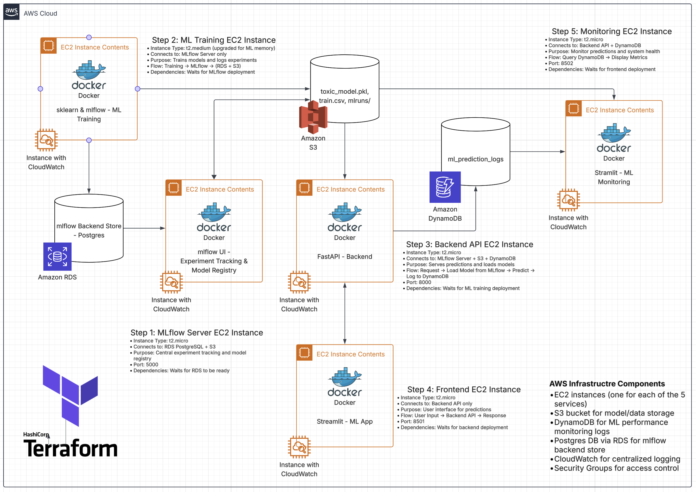

# Toxic Comment Analysis - AWS Deployment


[](https://deepwiki.com/jairus-m/toxic-mlops)

> **Note**: This project was heavily influenced and informed by the incremental learnings and implementations of my mlops project monorepo, [mlops-du](https://github.com/jairus-m/mlops-du). The architectural patterns, deployment strategies, and MLOps best practices demonstrated in this repository build upon the foundational work and lessons learned.

In addition, to view the final project rubric and screenshots of the AWS deployment view:
- `assets/docs/RUBRIC.md`
- `assets/docs/SCREENSHOTS.md`

## Project Dependencies
- [uv](https://docs.astral.sh/uv/getting-started/installation/)
- [task](https://taskfile.dev/installation/)
- [Docker Desktop](https://docs.docker.com/desktop/)
- [AWS CLI](https://docs.aws.amazon.com/cli/latest/userguide/getting-started-install.html)
- [Terraform](https://learn.hashicorp.com/tutorials/terraform/install-cli)

**Note**: For easy setup on macOS/Linux, use the included installation script after cloning the repo:
```bash
git clone https://github.com/jairus-m/toxic-mlops.git
cd toxic-mlops 
bash install-tools.sh
```
This shell script will install `uv`, `task`, `aws`, and `terraform` if they're not already present and will verify the installation.

## Table of Contents
- [Toxic Comment Analysis - AWS Deployment](#toxic-comment-analysis---aws-deployment)
  - [AWS Architecture](#aws-architecture)
    - [Filetree](#filetree)
  - [Local Architecture](#local-architecture)
  - [Local Dev Deployment](#local-dev-deployment)
    - [Prerequisites](#prerequisites)
    - [Configuration for Local Deployment](#configuration-for-local-deployment)
    - [Local Deployment with Docker Compose](#local-development-with-docker-compose)
  - [AWS Prod Deployment](#aws-prod-deployment)
    - [Prerequisites](#prerequisites-1)
    - [Configuration for AWS Deployment](#configuration-for-aws-deployment)
    - [AWS Deployment with Terraform](#aws-deployment-with-terraform)
      - [Step 1: Initialize Terraform](#step-1-initialize-terraform)
      - [Step 2: Deploy the Application](#step-2-deploy-the-application)
      - [Step 3: Access the App](#step-3-access-the-app)
      - [Step 4: Cleanup](#step-4-cleanup)

This project deploys a toxic comment analysis application on AWS using a fully automated Terraform setup. The architecture consists of a FastAPI backend, a Streamlit frontend, ML training, a Streamlit monitoring dashboard, and an MLflow tracking server. Each service runs in a Docker container on their own dedicated EC2 instances.

This project is structured as a multi-package monorepo using [uv workspaces](https://docs.astral.sh/uv/concepts/projects/workspaces/). Each application (`fastapi_backend`, `streamlit_frontend`, `sklearn_training`, `streamlit_monitoring`) has its own modules and dependencies while sharing a single `uv.lock` file at the root.

## AWS Architecture



Architecture Overview:
- **MLflow Server (EC2)**: Experiment tracking and model registry with PostgreSQL backend
- **ML Training Service (EC2)**: Downloads data, trains model, logs to MLflow, uploads to S3
- **FastAPI Backend (EC2)**: Provides inference API for toxic comment classification
- **Streamlit Frontend (EC2)**: User interface for testing comment toxicity
- **Streamlit Monitoring (EC2)**: ML Model performance monitoring dashboard
- **S3**: Stores model and data files, MLflow artifacts
- **DynamoDB**: Stores ML performance monitoring logs
- **RDS PostgreSQL**: MLflow backend store for experiments and runs
- **Infrastructure**:
  - Terraform manages AWS resources (EC2, S3, RDS, DynamoDB, Security Groups, CloudWatch)
  - Automated deployment with Docker containers
  - CloudWatch logging for all services

## Local Architecture
Locally, this project is orchestrated by Docker Compose. Each service is containerized with the same exact logic/code flow as the AWS deployment and has the same overall architecture as depicted above. However, when running with the environment variable `APP_ENV=development` (automatically set in `task dev:up`), the application uses the `config.yaml` to determine which local file paths to use instead of S3, DynamoDB, or RDS PostgreSQL:

```yaml
development:
  paths: # Local file paths
    data: "assets/data/train.csv"
    model: "assets/models/toxic_model.pkl"
    model_metadata: "assets/models/toxic_model_metadata.json"
  prediction_logging:
    handler: "file"
    path: "assets/logs/prediction_logs.json"
  mlflow: # MLflow tracking via local server
    tracking_uri: "http://mlflow-server:5000"
    experiment_name: "toxic-comments-classification" # Uses local SQLite DB for backend store
```

## Local Dev Deployment 

### Prerequisites
- `uv>=0.7.10`
  - [uv installation](https://docs.astral.sh/uv/getting-started/installation/)
- `task>=3.43.3`
  - [task installation](https://taskfile.dev/installation/)
- [Docker](https://docs.docker.com/get-docker/) and [Docker Compose](https://docs.docker.com/compose/install/) installed on your local machine.

### Configuration for Local Deployment
For running this project on your local machine, no configuration is needed. The application will use your local files instead of AWS services for storage and your CPU for computation.

### Local Development with Docker Compose
For a streamlined and consistent development experience that mirrors the production environment locally, you can use Docker Compose and the custom `task` commands.

From the root of the project, you can use the following commands:

1.  **Build and Start All Services**

    This single command builds the Docker images for MLflow server, ML training, the FastAPI backend, and the Streamlit frontend/monitoring, and then starts them in the correct order. It will first run the training container to generate the model and then launch the backend and frontend services.

    ```bash
    task dev:up TRAIN_MODEL=true
    ```

    You will see the logs from all services streamed to your terminal. Note that you can also pass `TRAIN_MODE=false` to skip training (in order to save time).

2.  **Access the Applications!**

    - **Frontend URL**: [http://localhost:8501](http://localhost:8501)
      - Submit a comment for toxicity analysis
      - Get the predicted toxicity classification
      - Provide feedback for whether the prediction was correct or not
    - **Monitoring URL**: [http://localhost:8502](http://localhost:8502)
      - View the performance/status of the ML toxic comment classification app
    - **MLflow UI**: [http://localhost:5000](http://localhost:5000)
      - Track experiments, compare model performance, and manage model registry
    - **Backend API Docs**: [http://localhost:8000/docs](http://localhost:8000/docs)
    - Note: If you want to follow the logs of the running services without blocking your main terminal, you can run:
      ```bash
      task dev:logs
      ```

3.  **Stop and Clean Up**

    To stop all the running services and remove the containers and network, run:

    ```bash
    task dev:down
    ```
4. **Optional: Unit Tests**

   To run unit tests:

    ```bash
    task dev:unit
    ```

    Unit tests in `tests/` do not need running services. They mock dependencies like the Kaggle dataset download, model training pipeline, Streamlit frontend imports, FastAPI backend, etc. to ensure core functionality of this application works in isolation.

## AWS Prod Deployment 

### Prerequisites
- The following need to be installed:
  - [AWS CLI](https://docs.aws.amazon.com/cli/latest/userguide/getting-started-install.html)
    - Need an AWS account with programmatic access along with the following credentials:
      - aws_access_key_id
      - aws_secret_access_key
      - aws_session_token
  - [Terraform](https://learn.hashicorp.com/tutorials/terraform/install-cli) installed on your local machine.
  - [uv](https://github.com/astral-sh/uv) installed on your local machine.
  - Docker Desktop (Contains both the Engine and CLI Client)
    - [docker installation](https://docs.docker.com/desktop/)

### Configuration for AWS Deployment
Within the project root, create an `.env` file and add the following:
```
# For AWS CLI / Boto3
AWS_ACCESS_KEY_ID=
AWS_SECRET_ACCESS_KEY=
AWS_SESSION_TOKEN=

# For Terraform (re-using the same values as above)
TF_VAR_aws_access_key_id=$AWS_ACCESS_KEY_ID
TF_VAR_aws_secret_access_key=$AWS_SECRET_ACCESS_KEY
TF_VAR_aws_session_token=$AWS_SESSION_TOKEN
```
While these AWS credentials are really only used in production, they are needed locally for Terraform for authentication in order to run CLI commands like `plan` and `apply` as well as for passing directly to the EC2 instances at launch time.

 > **Note**: You can find these credentials in the [AWS Academy Learner Lab](https://awsacademy.instructure.com/courses/127314/modules/items/12104634). From the Vocareum main page: Start Lab > AWS Details > AWS CLI: Show > Copy and Paste the CLI details into this local `.env` file. Putting it here instead of your ` ~/.aws/credentials` file allows for Terraform to pick up on the credentials and also makes it easier to reproduce my steps for this isolated project.

### AWS Deployment with Terraform

This workflow provisions the entire infrastructure and deploys the applications with Terraform.

#### Step 1: Initialize Terraform

1.  **Initialize Terraform**

    From the root of the project, run the following command to initialize Terraform. This will download the necessary providers and set up the backend.

    ```bash
    task prod:init
    ```

#### Step 2: Deploy the Application

1.  **Apply the Terraform Plan**

    Run the following command to create the AWS resources and deploy the application.

    ```bash
    task prod:apply TRAIN_MODEL=true
    ```

    This process will take some time as the EC2 instances need to start, transfer necessary application files, install dependencies, build the Docker images, and run them. You can pass an option `TRAIN_MODEL=false` to skip the model traning (in order to save time).

#### Step 3: Access the App

Once the `terraform apply` command is complete, it will output the public IP addresses of the application services.

- **Frontend URL**: `http://<FRONTEND_PUBLIC_IP>:8501`
- **Monitoring URL**: `http://<MONITORING_PUBLIC_IP>:8502`
- **MLflow Server URL**: `http://<MLFLOW_SERVER_PUBLIC_IP>:5000`

#### Step 4: Cleanup

To tear down all the AWS resources created by this project, run the `destroy` command:

```bash
task prod:destroy
```

**Tip**: Be weary of AWS state versus your local Terraform state. Manually changing resources in AWS and then running Terraform commands from the CLI can cause a lot of confusion and headache, so be careful when running these commands on your production AWS instance. However, if your Terraform lockfiles and states get out of sync and are causing you issues, run:

```bash
task prod:reset
```

This will delete all the local Terraform artifacts (to release the lock and reset state) and will re-initialize Terraform.

## AWS Infrastructure Components

The production deployment creates the following AWS resources:

- **EC2 instances** (one for each of the 5 services):
  - MLflow Server (t2.small) - Experiment tracking and model registry
  - ML Training (t2.medium) - Model training with memory requirements
  - FastAPI Backend (t2.micro) - Inference API
  - Streamlit Frontend (t2.micro) - User interface
  - Streamlit Monitoring (t2.micro) - Performance monitoring
- **S3 bucket** for model/data storage and MLflow artifacts
- **DynamoDB** for ML performance monitoring logs
- **RDS PostgreSQL** for MLflow backend store
- **CloudWatch** for centralized logging (easily viewable logs in AWS)
- **Security Groups** for access control
- **Key Pair** for SSH access to instances
